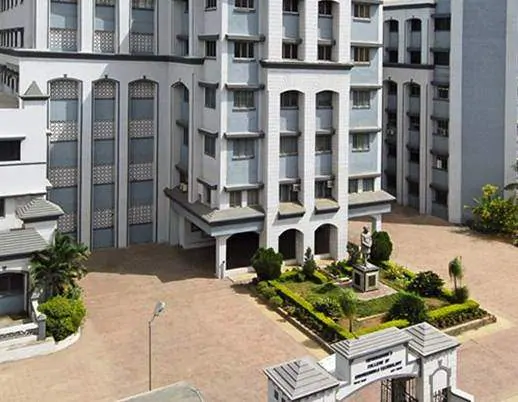

<!Doctype html>
<html>
<head>
<meta charset="utf-8">
<meta name="viewport" content="width=device-width, initial-scale=1.0">
<!-- Latest compiled and minified CSS -->
<link rel="stylesheet" href="https://maxcdn.bootstrapcdn.com/bootstrap/4.5.2/css/bootstrap.min.css">
<!-- jQuery library -->

<!-- Popper JS -->

<!-- Latest compiled JavaScript -->

</head>
<body>
	

	
	
Vidyavardhinis college of engineering and technology

	

  <ul class="nav">
    <li class="nav-item">
      <a class="nav-link" href="java mini.html">Home</a>
    </li>
    <li class="nav-item">
      <a class="nav-link" href="about us.html">about</a>
    </li>
    <li class="nav-item">
      <a class="nav-link" href="contacts.html">contacts</a>
    </li>
    <li class="nav-item">
      <a class="nav-link" href="mail.html">mail</a>
    </li>
  </ul>

 

The Vidyavardhini's College of Engineering and Technology(VCET), is an engineering college in Vasai-Virar. The college is affiliated to University of Mumbai and offers Bachelor's degree in Engineering. The college has been graded 'A' by the DTE. The five branches Computer Engineering, Electronics & Telecommunication Engineering, Information Technology Engineering, Instrumentation Engineering, and Mechanical Engineering have been accredited by National Board of Accreditation(NBA) for the period of 3 years w.e.f. April 2012.

Vidyavardhini’s College of Engineering and Technology, Vasai is located on the sprawling campus of Vidyavardhini, spread over an area of 12.27 acres. It is a short, two minutes walk from Vasai Road Railway Station.

Under-Graduate Degrees Offered
Each department listed below offers courses in their respective disciplines towards a BE degree.
 
B.E. (Civil Engineering)
 
B.E. (Computer Engineering)
 
B.E. (Electronics And Telecommunication Engineering)
 
B.E. (Information Technology)
 
B.E. (Instrumentation Engineering)
 
B.E. (Mechanical Engineering)# Regular shift
 
B.E. (Mechanical Engineering)# Second shift

	<button>
		Top
	</button>
</body>
</html>
